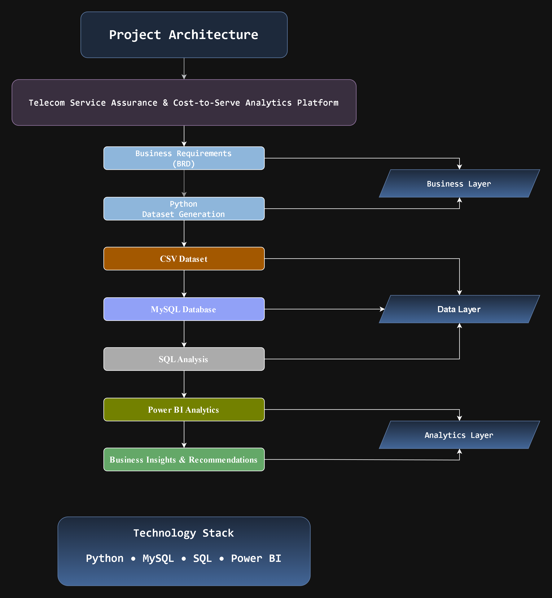
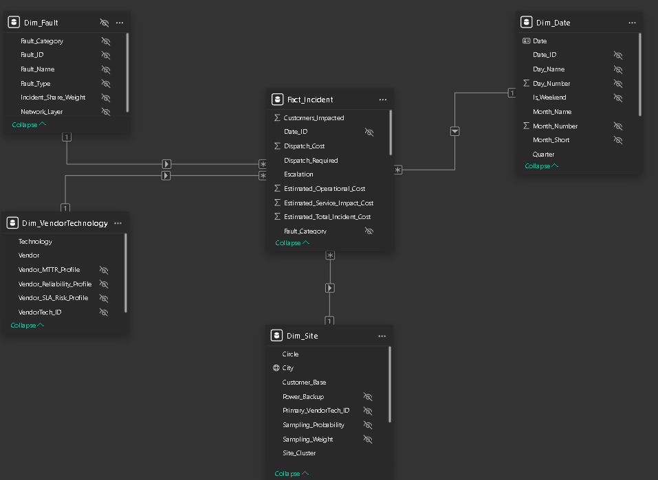
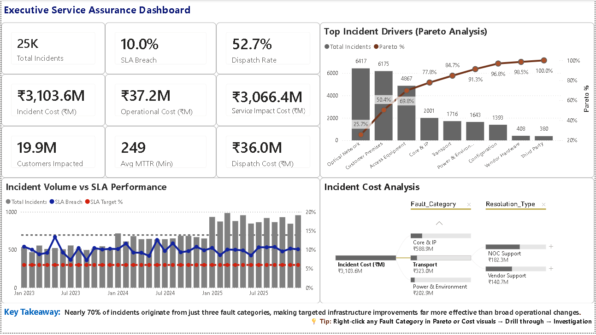
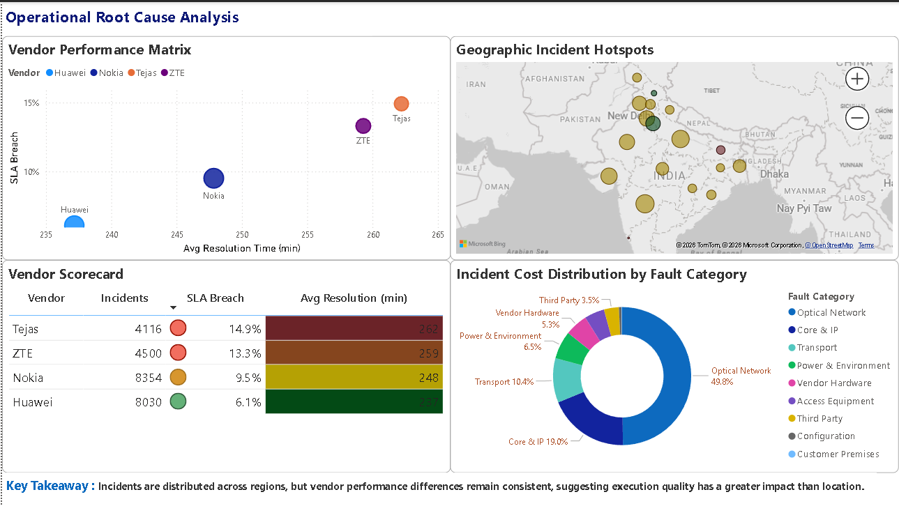
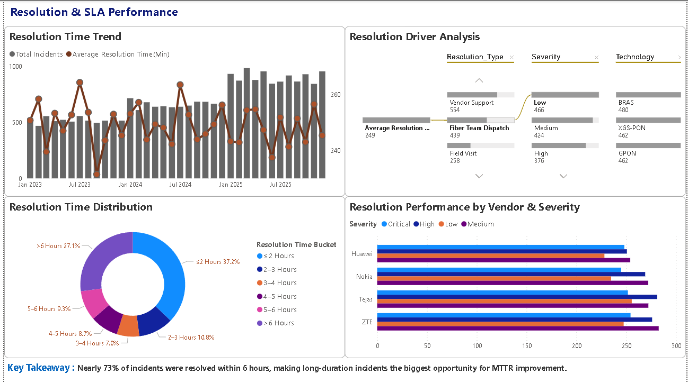
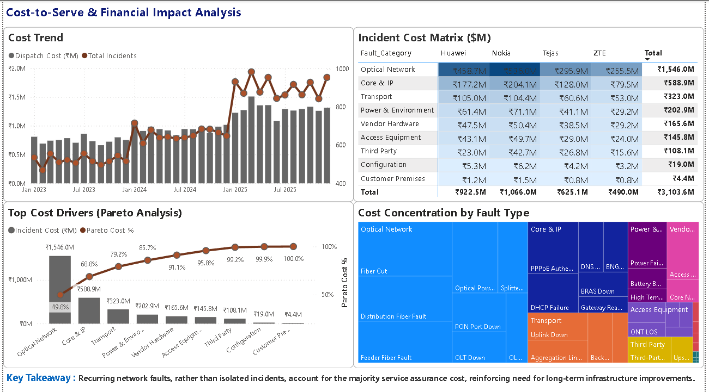
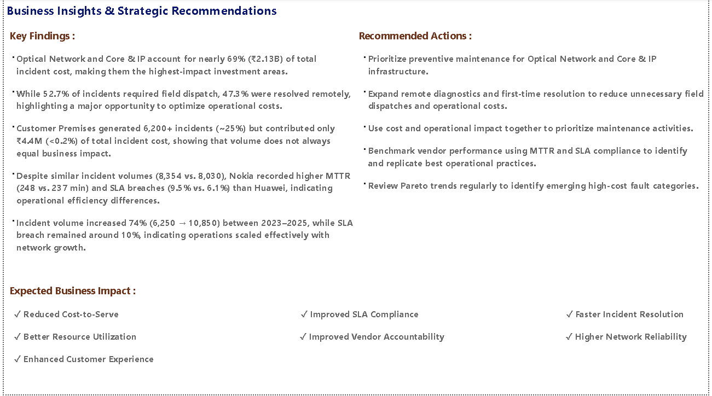

# Telecom Service Assurance & Cost-to-Serve Analytics Platform

Most analytics projects begin with existing data.

This project begins with a business problem.

A complete broadband service assurance environment was designed from scratch—including business requirements, synthetic operational data generation, dimensional data modeling, SQL-based analysis, and Power BI reporting—to demonstrate how data can support better operational decisions, reduce service cost, and improve SLA performance.

---

## Repository Contents

| Component | Included |
|-----------|:--------:|
| Python Dataset Generation Notebook | ✅ |
| Synthetic Telecom Dataset (CSV) | ✅ |
| MySQL Database Scripts | ✅ |
| SQL Business Analysis Queries | ✅ |
| Power BI Dashboard (.pbix) | ✅ |
| Dashboard Screenshots | ✅ |
| Business Requirements Document (BRD) | ✅ |
| Data Dictionary | ✅ |

---

## Business Problem

Broadband operators rarely struggle with a shortage of operational data. The challenge is converting thousands of daily incidents into clear operational priorities that improve service quality while controlling cost.

This project was developed to demonstrate how structured incident intelligence can support those decisions. A complete service assurance environment was designed from first principles, covering **25,000 broadband incidents**, **650 sites**, **40 fault types**, **13 vendor-technology combinations**, and **three years of operational history**.

The analysis concentrates on the operational drivers behind **SLA breaches, repeat faults, customer impact, dispatch efficiency, and cost-to-serve**, helping identify where operational improvements deliver the greatest business value.

The project addresses five key business questions:

- Which operational issues have the greatest business impact?
- Which vendors and technologies consistently underperform?
- Which incidents require immediate operational attention?
- Where are operational costs concentrated?
- Which improvement initiatives should be prioritised first?

---

# Project Snapshot

| Metric | Value |
|--------|------:|
| Analysis Period | Jan 2023 – Dec 2025 |
| Total Incidents | 25,000 |
| Network Sites | 650 |
| Geographic Coverage | 18 States & UTs |
| Fault Categories | 9 |
| Fault Sub-types | 40 |
| Vendors | Huawei, Nokia, ZTE, Tejas |
| Technologies | GPON, XGS-PON, BRAS |
| Dashboard Pages | 6 |
| SQL Analysis Scripts | 8 |

---

# Solution Overview

The project follows a structured business intelligence workflow that mirrors how an analytics solution is typically delivered in an enterprise environment.

1. Business requirements were translated into measurable analytical objectives.
2. A realistic broadband service assurance dataset was generated in Python using business-defined operational rules.
3. The data was loaded into a dimensional star schema in MySQL for structured analysis.
4. SQL was used to validate the dataset and answer key business questions.
5. Power BI transformed the analytical model into interactive dashboards for operational monitoring and executive reporting.
6. Analytical findings were translated into actionable business recommendations supported by quantitative evidence.

This approach demonstrates the complete analytics lifecycle—from business problem definition to executive decision support—rather than dashboard development alone.

---

# Technology Stack

| Stage | Technology |
|---------|------------|
| Business Analysis | BRD, Business Process Mapping |
| Data Generation | Python, Pandas, NumPy |
| Data Storage | CSV |
| Database | MySQL |
| Data Modeling | Star Schema |
| Data Analysis | SQL |
| Business Intelligence | Power BI, Power Query, DAX |
| Documentation | BRD, Data Dictionary, GitHub |

---

# Project Architecture

The solution follows a structured analytics workflow beginning with business requirements, followed by Python-based dataset generation, SQL dimensional modeling, business analysis, and interactive Power BI reporting.

<p align="center">

</p>

---

# Dimensional Data Model

The analytical model follows a dimensional star schema designed to support efficient reporting, simplified querying, and scalable business analysis.

The model consists of:

- **1 Fact Table** — Incident-level operational records
- **4 Dimension Tables** — Date, Site, Fault, and Vendor & Technology

<p align="center">

</p>

---

# Dashboard Preview

## Executive Service Assurance Dashboard



Executive summary of broadband service assurance performance, combining operational KPIs, SLA compliance, incident trends, Pareto analysis, and cost-to-serve metrics into a single management view for rapid decision-making.

---

## Operational Root Cause Analysis



Analyzes incident distribution by geography, fault category, vendor, technology, and network layer to identify the operational drivers behind recurring service issues.

---

## Resolution & SLA Performance



Evaluates incident resolution efficiency, SLA compliance, escalation behaviour, dispatch patterns, and repeat faults to identify opportunities for operational improvement.

---

## Cost-to-Serve & Financial Impact



Examines the operational cost associated with broadband incidents, highlighting cost drivers, customer impact, dispatch expenditure, and vendor-related financial performance.

---

## Business Insights & Strategic Recommendations



Summarizes the most significant analytical findings and translates them into practical operational recommendations for improving service quality, reducing costs, and strengthening SLA performance.

---

## Incident Investigation (Drillthrough)

.png)

Interactive drillthrough page that enables detailed investigation of individual fault categories, supporting root-cause analysis and operational troubleshooting at incident level.

---

# Key Business Insights

- **69.8% of all incidents originated from just three fault categories**, making targeted infrastructure improvements more effective than broad operational initiatives.

- **Escalated incidents (17.0% of total volume) breached SLA at 53.3%, compared with just 1.1% for non-escalated incidents**—a 48× increase.

- **47.3% of incidents were resolved remotely**, avoiding field dispatches and reducing operational costs without compromising service restoration.

- **Tier-1 critical sites accounted for a disproportionate share of customer impact and service cost**, making them the highest-priority candidates for proactive maintenance.

- **Average incident resolution time was 249 minutes, with a 10.0% overall SLA breach rate**, indicating that improving restoration efficiency offers the greatest opportunity to enhance service performance.

- **Total incident cost reached ₹310.4M across 25,000 incidents**, demonstrating that faster resolution and smarter incident prioritization deliver greater business value than simply reducing incident volume.
---

# Repository Structure

```
Telecom-Service-Assurance-Analytics
│
├── dashboard
│   └── Telecom_Service_Assurance_Analytics.pbix
│
├── data
│   ├── Dim_Date.csv
│   ├── Dim_Fault.csv
│   ├── Dim_Site.csv
│   ├── Dim_VendorTechnology.csv
│   └── Fact_Incident.csv
│
├── docs
│   ├── Telecom_Service_Assurance_BRD.pdf
│   └── Data Dictionary.xlsx
│
├── images
│   ├── Executive_Service_Assurance.png
│   ├── Operational_Root_Cause.png
│   ├── Resolution_&_SLA_Performance.png
│   ├── Cost_to_Serve_&_Financial_Impact.png
│   ├── Business_Insights_&_Strategic_Recommendations.png
│   ├── Incident_Investigation_(Drillthrough).png
│   ├── Star_Schema_Model.png
│   └── Project_Architecture.png
│
├── python
│   └── Telecom_Service_Assurance_Analytics.ipynb
│
├── sql
│   ├── 01_Project_Setup.sql
│   ├── 02_Create_Database.sql
│   ├── 03_Load_Data.sql
│   └── Analysis_Queries
│       ├── 01_Operational_Cost_Intelligence.sql
│       ├── 02_SLA_Performance_Intelligence.sql
│       ├── 03_Customer_Impact_Intelligence.sql
│       ├── 04_Service_Reliability_Intelligence.sql
│       └── 05_Cost_to_Serve_Intelligence.sql
│
└── README.md
```
---

# Author

**Ankit Attri**

Broadband Network Engineer transitioning into Business Intelligence and Data Analytics.

This project was independently designed and developed to demonstrate end-to-end analytical problem solving from business requirement definition and synthetic dataset generation through SQL analysis, dimensional modeling, Power BI dashboard development, and executive reporting.

If you found this project useful or have suggestions for improvement, feel free to connect or provide feedback.
